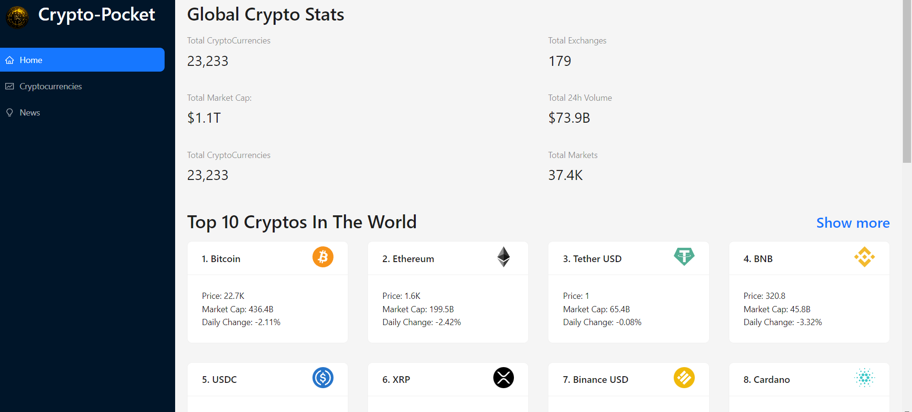
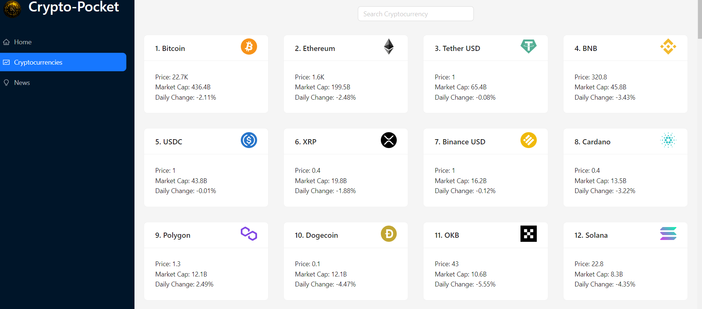
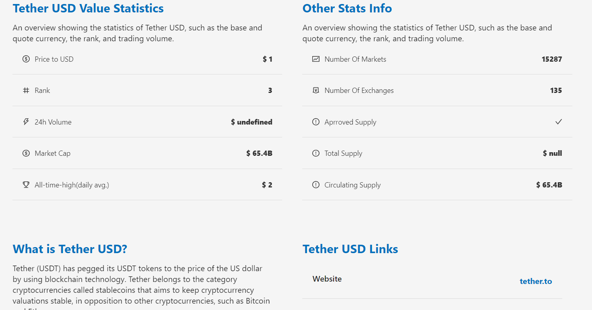
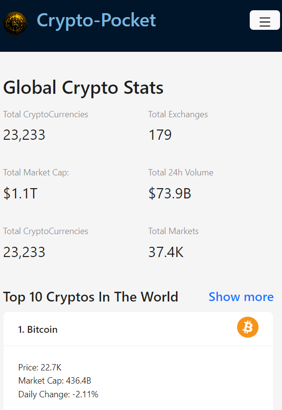

# Crypto Pocket

Crypto Pocket is a responsive cryptocurrency dashboard for exploring market data, price history, and crypto news.

## Features

- View global market statistics and leading cryptocurrencies.
- Search and browse cryptocurrency prices, market caps, and daily changes.
- Open a coin details page with price history, supply and market statistics, project description, and related links.
- Browse crypto news and filter articles by cryptocurrency.
- Use the dashboard on desktop and mobile screens.

## Screenshots

### Home



### Cryptocurrency list



### Coin details



### Mobile layout



## Tech stack

- **React 18** with Create React App
- **Redux Toolkit and RTK Query** for API requests and cached server state
- **Ant Design** for interface components
- **Chart.js** and **react-chartjs-2** for price charts
- **React Router 6** with hash-based routing, so coin detail links work on static hosting without server-side route rewrites
- **millify** for compact number formatting
- **html-react-parser** for rendering coin descriptions

## Data APIs

- **Coinranking API** through RapidAPI for coin prices, details, history, and market statistics.
- **Bing Search APIs** through RapidAPI for crypto news.

Both services use the `REACT_APP_RAPIDAPI_KEY` environment variable.

## Getting started

### Requirements

- Node.js and npm
- A RapidAPI key subscribed to the Coinranking API and Bing Search APIs used by this app

### Install and configure

```powershell
npm install
Copy-Item .env.example .env.local
```

Add your RapidAPI key to `.env.local`:

```text
REACT_APP_RAPIDAPI_KEY=your_rapidapi_key
```

Restart the development server after changing the environment file.

### Run locally

```powershell
npm start
```

The app opens at [http://localhost:3000](http://localhost:3000).

## Available scripts

| Command | Description |
| --- | --- |
| `npm start` | Start the development server. |
| `npm run build` | Create an optimized production build in `build/`. |
| `npm test` | Run the Create React App test runner. |

## Environment variable note

`.env.local` is ignored by Git. Create React App embeds `REACT_APP_*` values into the browser bundle, so the RapidAPI key is visible to users of a deployed client-side app. Use a backend proxy if the key must remain private.
